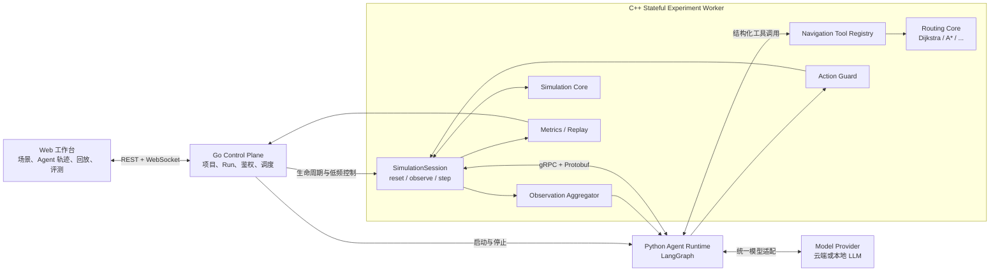

# Zeus 地理空间导航智能体环境：架构与实施计划

> 文档状态：目标架构，待分阶段实施
>
> 最后更新：2026-09-05
>
> 关联文档：[overall-architecture.md](overall-architecture.md)、[simulation-core-design.md](simulation-core-design.md)、[routing-core-design.md](routing-core-design.md)

## 1. 定位

Zeus 从“导航算法验证平台”升级为“面向地理空间智能体的动态道路仿真与评测平台”。现有地图、路由和交通仿真不推倒重做，而是成为智能体可以观察和操作的 Environment。

平台研究的核心问题变为：

> 在动态、部分可观测的道路环境中，智能体能否通过环境感知、算法工具调用、记忆和持续决策，获得比单一导航算法更好的综合导航能力？

导航仍是第一个 Benchmark，后续可以扩展应急、物流、公交、救援和行人智能体。

## 2. 核心原则

1. LLM 不计算最短路，A*、Dijkstra、D* Lite 等确定性算法作为智能体工具。
2. C++ 内核是地图、仿真时钟、车辆状态和路线合法性的唯一事实源。
3. Agent 在决策边界选择算法、比较候选路线并提交动作，不直接写内核内存。
4. 仿真 tick 与 LLM 推理解耦；普通车辆高频推进，Agent 低频或事件触发决策。
5. 万级车辆不等于万级 LLM Agent，采用车辆、区域、全局三级分层。
6. 所有模型输出必须经过结构化校验、权限校验和确定性安全门。
7. 每次观察、工具调用、候选路线、选择理由和提交结果均可追踪、回放和评测。
8. Agent 框架和模型供应商位于适配层，不能成为仿真协议的一部分。

## 3. 目标闭环

```text
reset
  ↓
observe ──→ trigger gate ──→ reason/plan ──→ call tools
  ↑                                            ↓
feedback ←── environment step ←── commit action ←── guard/evaluate
```

一次典型决策不是“让 LLM 返回道路 ID 列表”，而是：

1. Environment 生成结构化 Observation。
2. 确定性 Trigger Gate 判断是否需要调用 Agent。
3. Agent 根据任务、当前状态和记忆选择一个或多个算法工具。
4. 路由内核返回候选路线及统一指标。
5. Guard 比较收益、冷却时间、状态版本和合法性。
6. Agent 提交 `commit_route` 或 `keep_route`。
7. C++ 在 tick 提交边界原子应用动作。
8. Environment 推进一步并产生反馈。

## 4. 总体架构



### 4.1 组件职责

| 组件 | 责任 | 不承担的责任 |
| --- | --- | --- |
| Go Control Plane | 项目、版本、Run、调度、鉴权、结果索引 | 逐 tick 决策、路线计算 |
| Python Agent Runtime | Agent 状态机、模型调用、工具编排、记忆 | 仿真事实状态、最短路计算 |
| C++ SimulationSession | 有状态仿真、观察生成、动作提交、确定性时钟 | 自然语言推理 |
| Navigation Tool Registry | 算法发现、能力声明、参数验证、统一结果 | 决定最终采用哪条路线 |
| Action Guard | 路线合法性、收益门槛、冷却、超时和版本检查 | 生成候选路线 |
| Web | 可视化 Observation/Decision/Action/Feedback 和实验对比 | 作为正式 Agent 运行时 |

## 5. LLM 与 Agent 框架选择

### 5.1 主框架：Python LangGraph

主运行时采用 Python LangGraph 的低层 Graph API，原因是 Zeus 的控制流天然是一个长期、有状态、带循环且混合确定性节点与 LLM 节点的状态图：

```text
Observe → Trigger → Decide → Tool Call → Guard → Commit → Step → Observe
```

需要使用的能力包括状态持久化、暂停/恢复、超时、人工介入、记忆和完整轨迹。图中的 `Trigger`、`Guard`、`Fallback` 必须是确定性代码，只有语义判断和策略选择进入模型节点。

### 5.2 模型接入：独立 ModelProvider

Agent Runtime 只依赖内部接口（v1 同步签名，与同步 HTTP 客户端及普通 LangGraph 节点一致，异步化随传输层替换一并处理）：

```python
class ModelProvider(Protocol):
    def decide(self, request: DecisionRequest) -> DecisionResponse: ...
```

首个实现可以使用 OpenAI Responses API，也可以增加本地模型或其他兼容供应商。Observation、Action 和 Tool Schema 使用 Zeus 自己的 Pydantic/Protobuf 模型，不直接使用某个供应商的消息类型。

### 5.3 OpenAI Agents SDK 的位置

OpenAI Agents SDK 适合实现轻量的 manager-agent、工具调用、handoff 和 tracing，可作为第二套运行时适配或实验基线。第一版不建议让它和 LangGraph 同时控制同一个决策循环，否则会出现状态、重试和追踪的双重归属。

选择原则：

- Zeus 主闭环、复杂状态与确定性门控：LangGraph。
- 简单单 Agent 工具调用或框架对照实验：OpenAI Agents SDK。
- 只需要直接模型调用：官方模型 SDK/Responses API，不额外套 Agent 框架。

### 5.4 Environment API 标准

- 内部权威协议：gRPC + Protobuf，连接 Python Agent Runtime 与 C++ Stateful Worker。
- 单智能体 Python 适配：Gymnasium 风格 `reset/step`。
- 多智能体 Python 适配：PettingZoo Parallel 风格，以 Agent ID 映射观察和动作。
- MCP：可作为外部调试、演示和人工交互接口，不进入高频仿真热路径。

## 6. Agent 状态与接口

### 6.1 Observation

```text
NavigationObservation
├── run_id / tick / simulation_time
├── state_version
├── agent_id / vehicle_id / region_id
├── current_position: edge_id + offset
├── destination
├── current_route + current_algorithm
├── remaining_eta / delay / congestion_exposure
├── nearby_road_summary
├── active_events
├── route_invalidated
├── replan_recommended
├── available_tool_capabilities
└── bounded_memory_summary
```

Observation 必须有大小预算。万级原始车态先在 C++ 聚合为路段或区域态势，再提供给 Agent，不能把整个世界序列化进 prompt。

### 6.2 Action

第一版动作空间保持小而明确：

```text
NavigationAction
├── keep_route
├── request_route_candidates
├── commit_route(candidate_id, expected_state_version)
├── defer(until_simulation_time)
└── report_no_safe_action(reason_code)
```

未来区域 Agent 再增加 `update_region_cost_policy`、`assign_route_policy` 和 `request_global_coordination`，不允许自然语言直接成为仿真动作。

### 6.3 Stateful Worker

现有同步 `simulate` 请求需要演进为：

```text
CreateSession(config) -> session_id
ResetSession(session_id) -> observation
Observe(session_id, scope) -> observation
EvaluateRoutes(session_id, requests[]) -> candidates[]
CommitActions(session_id, actions[]) -> results[]
StepSession(session_id, steps | until_event) -> observation + events + rewards
SnapshotSession(session_id) -> snapshot_id
RestoreSession(snapshot_id) -> session_id
CloseSession(session_id)
```

`StepSession(until_event)` 是事件驱动 Agent 的关键：C++ 可以连续推进普通 tick，直到事故、封路、路线失效、ETA 显著恶化或决策周期到达，再唤醒 Agent。

## 7. 算法作为工具与动态切换

### 7.1 可以动态切换，而且这正是目标设计

Agent 不绑定单一算法。它可以在不同决策时点选择不同工具：

```text
初始规划：A*，快速得到单条最优路线
事故发生：D* Lite，增量修复当前路线
多个绕行方案接近：K Shortest Paths，生成候选集
周期拥堵：Time-dependent Routing，考虑未来到达时刻
基准校验：Dijkstra，检查小图最优性
```

这里的“切换”发生在一次新的规划请求上，而不是把 A* 已展开一半的 Open Set 无条件交给 Dijkstra 或 D* Lite。不同算法的内部搜索状态通常不兼容；只有明确实现共享状态或增量接口时才复用搜索状态。

### 7.2 Tool Registry

每个算法注册统一能力元数据：

```text
AlgorithmCapability
├── algorithm_id / version
├── supported_objectives
├── supports_dynamic_weights
├── supports_incremental_repair
├── supports_k_candidates
├── supports_time_dependency
├── supports_turn_restrictions
├── expected_latency_class
├── deterministic
└── parameter_schema
```

第一版工具：

```text
get_navigation_observation()
query_road_state(edge_ids | region)
query_active_events(region)
list_routing_algorithms(required_capabilities)
plan_route(algorithm_id, origin, destination, objective, constraints)
plan_route_candidates(algorithm_id, k, ...)
estimate_routes(candidate_ids)
commit_route(candidate_id, expected_state_version)
keep_route(reason_code)
```

现有 `dijkstra`、`astar`、`bidirectional_dijkstra`、`bidirectional_astar` 首先接入注册表；D* Lite、LPA*、K Shortest Paths 和时间依赖路由作为后续算法版本增加。

### 7.3 一次动态切换示例

```text
Observation:
  当前路线由 A* 生成；前方事故；ETA +12 min；state_version=1842

Agent:
  调用 list_routing_algorithms(dynamic_weights=true)
  调用 plan_route_candidates(k_shortest, k=3)
  调用 estimate_routes(...)

Guard:
  候选 2 合法；预计节省 8 min；超过 2 min 收益阈值；不在冷却期

Action:
  commit_route(candidate_2, expected_state_version=1842)

Environment:
  在下一 tick 提交边界替换路线，记录 A* → KSP → candidate_2
```

### 7.4 安全门与退化策略

动态切换必须包含：

- 算法白名单、能力匹配和参数 JSON Schema 校验。
- 候选路线与提交动作分离，模型不能伪造 `candidate_id`。
- 拓扑、禁转、封路、车辆类型和终点一致性检查。
- `expected_state_version` 乐观并发校验，拒绝基于旧状态的动作。
- 最小收益阈值、重规划冷却、最大重规划次数和路线稳定性窗口。
- 单次决策超时、工具预算、token 预算和循环次数上限。
- 模型或框架失败时使用确定性 fallback：保持当前有效路线，或调用动态 A*。
- 对紧急车辆可使用独立权限和约束，不能通过 prompt 绕过内核规则。

## 8. 分层多智能体架构

```text
1–10 Global / Coordinator Agents
              ↓ 区域策略与冲突协调
100–500 Regional Agents
              ↓ 成本策略、路线配额、事件响应
10,000+ Lightweight Vehicles
```

### 8.1 车辆层

- 使用 C++ 状态机、规则和传统导航算法。
- 按仿真频率推进，不逐 tick 调用 LLM。
- 上报结构化最小状态：道路、速度、延误、目的地区域和异常标志。

### 8.2 区域层

- 对道路和车辆聚合，维护区域态势。
- 可以是规则 Agent、小模型 Agent 或事件触发 LLM Agent。
- 负责局部拥堵响应、路线策略和向全局层升级冲突。

### 8.3 全局层

- 处理跨区域事件、系统最优、应急车辆和策略冲突。
- 低频运行，输出策略或约束，不逐车微操。

### 8.4 通信原则

- 使用结构化事件和聚合状态，不使用车辆间自然语言群聊。
- 区域状态建议 0.2–1 Hz 聚合；LLM 仅在阈值、异常或固定决策周期触发。
- 对重复事件去重、合并和限流。
- 所有协调动作携带作用域、版本、有效期和撤销条件。

## 9. Memory 设计

Memory 分三层：

1. Working Memory：当前任务、路线、最近观察和未完成工具调用。
2. Episodic Memory：本次 Run 中的事故、切换、结果和失败经验。
3. Historical Traffic Memory：按道路、星期、时间窗聚合的历史速度和拥堵概率。

历史记忆只提供预测特征，不能覆盖当前道路封闭等实时事实。所有记忆条目需要来源、时间范围、置信度和过期策略。第一版先实现结构化时序统计，不急于接入向量数据库。

## 10. 评测设计

### 10.1 对照方法

| 方法 | 路径规划 | 动态决策 | Memory | 多工具 |
| --- | --- | --- | --- | --- |
| A* | 是 | 否 | 否 | 否 |
| 动态 A* / D* Lite | 是 | 是 | 否 | 否 |
| LLM 直接输出路线 | 是 | 是 | 可选 | 否 |
| Navigation Agent | 是 | 是 | 是 | 是 |

“LLM 直接输出路线”只用于小图研究基线，不作为生产能力。

### 10.2 场景

- 静态路网。
- 随机或预编排拥堵。
- 突发事故和道路封闭。
- 周期性拥堵。
- 多事件组合。
- 多 Agent 同时绕行造成的次生拥堵。
- 个体最优与系统最优冲突。

### 10.3 指标

- 任务成功率、Travel Time、Route Length。
- Replanning Count、Congestion Exposure、路线抖动。
- Decision Latency、工具调用次数、无效动作率和 fallback 率。
- LLM token/费用、Agent 通信量和每仿真秒推理量。
- 网络总旅行时间、吞吐量、公平性和系统最优差距。
- 仿真实时倍率、决策队列积压和超时率。

## 11. 可复现与审计

每次 Agent 决策至少记录：

```text
run_id / agent_id / decision_id
tick / simulation_time / state_version
observation_hash + observation artifact
agent_policy_version
model_provider / model / sampling parameters
prompt_template_version
memory_snapshot_hash
tool calls + arguments + results
candidate routes + normalized metrics
guard decisions
committed action + environment result
latency / token usage / failure and fallback
```

模型策略与确定性算法分开评价。即使模型输出不能逐字复现，也必须能够重放记录过的动作，重新计算同一候选路线并验证结果。

## 12. 分阶段实施计划

### 当前落地状态（2026-09-05）

- `zeus-map session-worker <map.zmap>` 常驻进程已实现：stdin/stdout tab 帧协议（`ZEUS_SESSION_WORKER`/`ZEUS_SESSION_RESPONSE`），命令覆盖 reset、observe、agent-observe、plan、commit、keep、step、step_event、resume、run-to-end、pause、snapshot、restore、drop-snapshot、result、close、shutdown；一个进程按 session_id 承载多张会话。`resume` 非阻塞启动引擎线程，允许同一命令通道继续处理 pause/observe 和其他会话。
- 引擎在每个已提交 tick 边界发布 `TickSnapshot`：热边（占用/容量/封闭/速度与路由代价因子/均速）、agent 车辆切片（位置、路线、ETA、路线失效标记）、决策事件与原因；`step_event` 推进至 agent 路线失效或周期扫描事件后暂停。单车 Observation 通过地图空间索引筛选车辆 2 km 内最多 64 条热边，不再按全局热边顺序截断。
- 动作注入已实现：`commit` 在下一 tick 边界从车辆实时位置按候选记录的算法确定性重规划（候选路径本身不跨边界，杜绝陈旧位置），`keep` 为版本校验确认；agent 车辆被排除出自动重规划。
- Go 控制面：`SessionWorkerManager`（按地图常驻、LRU、挂死重启）+ `/api/maps/{id}/agent/sessions/*` 端点（创建/观察/plan/step/actions/run/pause/result/关闭），决策边界自动开 `DecisionCoordinator` 屏障（默认 5 分钟墙上 TTL，可配置）；超时 fallback 会把版本校验的 keep_route 实际提交到 C++。actions 采用两阶段语义，只有 Worker 明确接受后才关闭屏障，拒绝时保留决策供修正；每个 Session 有活动决策门禁，未处理前拒绝继续 step。HTTP `/run` 使用非阻塞 resume，因此 `/pause` 可在后续请求中生效。
- 持久化 Snapshot/Restore 已实现：只允许在暂停或完成边界创建快照，按版本化 JSON 保存地图、请求、目标 tick 和已接受的 commit/keep 动作日志；restore 通过确定性重放创建独立 Session，控制服务或 Worker 重启后仍可加载。Go 已提供创建、恢复和删除快照端点；恢复到决策边界时会为新 Session 打开独立 Decision Barrier。
- 四算法 Tool Registry 已实现：C++ `algorithmCapabilities()` 是能力元数据的唯一来源，`session-worker tools` 与 `GET /api/maps/{id}/agent/tools` 暴露 registry version、算法版本、搜索方向、动态权重、增量修复、K 候选、时间依赖、确定性和精确性声明；单车 Observation 同步携带该能力列表。
- 同步落地保真度修复：出口放行间隔默认 1.4/2.0 s 且到达免闸、min_speed_ratio 默认 0（饱和路段真停，含动态代价除零保护）、移动序按队列序放行、per-edge KPI（entries/vehicle_seconds/mean_speed，playback 导出）、建图期自动生成转向罚时（U-turn 5 s、急左转 2 s、支路进干路 3 s，max-merge sidecar）。
- A2 单导航智能体最小闭环已交付（apps/agent-runtime，uv + LangGraph + httpx + pydantic）：
  - `EnvironmentClient` Protocol + HTTP 实现（传输抽象；HTTP-first 是 A2 的明确决策，目标 gRPC 边界未放弃）；
  - `RulePolicy` 确定性回归基线（无有效候选→keep；路线失效→commit 最优；改进 ≥10% 才 commit；timeS→lengthM→candidateId 确定性排序）与 `MockModelProvider`（按触发词脚本或包装 RulePolicy）；
  - 决策图八节点 advance→observe→select_tools→plan→compare→decide→guard→act：LangGraph `StateGraph` 是默认执行器，`run_nodes()` 仅作为依赖损坏时的确定性故障兜底；`run_episode(use_langgraph=...)` 已真实选择执行路径，不再忽略参数；
  - `ModelProvider` 已真正接入 decide 节点；提供严格 JSON 输出的 Chat Completions 兼容 HTTP 适配器，Observation prompt 有长度预算，模型只能选择环境签发的候选，记录模型名、延迟、输入/输出 token 与简短 rationale；传输、结构或候选校验失败时用 `RulePolicy` 解开屏障；
  - LangGraph SQLite Checkpointer 已接入稳定 `thread_id`：可在任一确定性节点后中断，并用同一图线程从下一节点恢复；恢复不重新创建环境 Session，也不重复执行已完成节点。`zeus_runs` 和 `zeus_decision_traces` 独立记录运行状态与逐节点写入，覆盖 Observation、候选工具、模型决策、Guard、Action、仿真 tick/state_version、延迟和 token 指标；`python -m zeus_agent.trace` 支持按线程和节点查询 JSON；
  - Action Guard：候选 ok、basedOnStateVersion 与观察版本一致、改进比 ≥10%（路线失效豁免改进与冷却检查）、提交冷却仅在自愿切换之间生效；提交失败确定性 fallback 为 keep_route；
  - Gymnasium 风格 `ZeusEnv`（reset/step，reward=ETA 减少量，惰性接入 gymnasium）与 `python -m zeus_agent.run` CLI；
  - Benchmark phase 1 已交付：JSON 清单定义场景、控制事件、固定种子、策略与重复次数；顺序运行 fixed、reactive、rule_agent、model_agent 四类策略，限制固定/反应式基线的算法工具集合；读取 C++ 权威结果与 playback edge KPI，按节点计时并聚合成功率、旅行时间、路线长度、重规划、路线工具调用、拥堵暴露、决策/模型延迟、实时倍率、token 和配置化费用，导出内嵌清单的版本化 JSON 与逐次运行 CSV。
  - Benchmark Job Service 已交付：标准库 HTTP API 提交/列表/状态/结果/取消，SQLite 持久化清单、进度与报告，线程池限制并发和队列容量；运行中取消在决策安全边界提交 keep 并关闭 Session，排队任务可无执行取消；服务重启后未完成任务从头重新排队，模型密钥只从服务进程环境变量读取。
  - Go 控制面 Benchmark 同源代理已交付：`/api/benchmarks` 与全部任务子路径保留方法、查询、请求体、状态码和响应头转发到可配置上游；连接失败返回稳定 `502` JSON，非法配置返回 `503`，浏览器默认不再跨域直连 `8090`。
  - Benchmark Web 工作台已交付：可视化组合多场景、OD、道路/车辆控制事件、重复次数和四类策略；异步提交后轮询任务、显示场景 × 策略进度矩阵、取消运行和浏览历史，完成报告提供跨策略聚合图表、逐次运行证据及 JSON/CSV 下载。已用真实任务服务验证提交→运行→取消/完成链路，并通过 1440/760/390 px 响应式冒烟。
  - 51 个单元测试（httpx.MockTransport 脚本化假环境，含 409→fallback、模型非法候选/非法 JSON、模型失败规则降级、LangGraph 与显式纯循环路径、SQLite 节点中断→跨调用恢复且不重复 Session/动作、DecisionTrace 去重与 thread_id 防碰撞、四策略评测矩阵、任务持久化/取消/恢复和 HTTP 生命周期）；e2e 封路场景在真实武汉地图通过：252 边路线 t=1517s 封中段边 → observe 后持久化中断 → 重新打开 SQLite 恢复 → 四算法比较 → commit → 4567 tick 到达，78 次决策、约 5.5s 墙钟，审计链完整。
- 尚未实现：Benchmark 统一鉴权、用户级配额与进程监管、跨进程分布式任务调度、场景种子驱动的随机事件生成、路线抖动与无效动作等二阶段指标、worker 内阻塞式 BARRIER 决策模式（现为请求驱动异步环）、Protobuf 生成代码/gRPC 接入、生产模型供应商的在线验收与密钥管理、D* Lite 与 K 最短路（比较器已算法无关）。

### 2026-08-30 之前的状态（历史）

- 已定义 `proto/agent/v1/agent_environment.proto`，覆盖三种决策模式、Observation、Action、DecisionTrace、state version、仿真时间有效期和目标 Session 服务。
- 已在 Go 控制服务实现线程安全的 `DecisionCoordinator`：注册后再发布观察，支持 Barrier 阻塞等待、墙上时间超时、确定性 fallback、取消/关闭回收，以及提交时的 Agent、`state_version` 和 TTL 校验。
- 已完成 128 个并发决策屏障、过期响应、错误 Agent、重复等待、取消、超时 fallback 和关闭回收的普通及 race 测试。
- 已实现 C++ `SimulationSession`：原 `SimulationEngine::run()` 保持兼容，通过可选 tick 边界控制器在不暴露热状态的前提下支持 reset、step、observe、run-to-end、pause 和 close；每个已提交 tick 与每次 reset 都推进单调 `state_version`。
- Stateful Session 的墙上等待时间单独记录为 `barrier_wait_ms`，不计入内核 `compute_ms`，避免 LLM 等待污染仿真性能指标。
- Session 已完成逐步执行与一次性执行等价、reset 版本失效、暂停关闭和部分结果保留测试；现有同步 `simulate` 行为保持不变。
- 下一切片是为 `zeus-map` 增加常驻 session-worker 协议，将 C++ Session 的 observe/step/close 接到 Go 控制面和 `DecisionCoordinator`；道路/车辆聚合 Observation、动作注入和 snapshot 仍未实现。

### A0：接口与基线

- 定义 Observation、Action、Tool、DecisionTrace Protobuf。
- 为现有四种 C++ 路由算法增加 Tool Registry 元数据。
- 用规则策略复现当前动态重规划，作为 Agent 环境回归基线。

### A1：有状态 Environment MVP（进行中）

- 将同步仿真演进为可创建、暂停、观察、step、快照和关闭的 `SimulationSession`。
- 实现 `until_event` 推进和 state version。
- 实现 Python gRPC 客户端及 Gymnasium 风格适配器。
- 保持 C++ 为唯一状态源，并完成确定性 replay 测试。

### A2：单导航智能体

- 建立 Python `apps/agent-runtime` 和 LangGraph 状态图。
- 接入 ModelProvider、结构化工具调用、Action Guard 和 fallback。
- Web 增加 Observation / Reasoning Summary / Tool / Action 时间线。
- 完成 A*、动态算法和 Navigation Agent 对照实验。

### A3：Memory 与主动导航

- 增加历史道路时段统计和可审计 Memory。
- 实现“当前未堵但未来高概率拥堵”的提前绕行实验。
- 分离记忆命中收益和错误记忆风险指标。

### A4：分层多智能体

- 实现区域聚合、PettingZoo Parallel 适配和区域 Agent。
- 增加少量 Coordinator Agent 与冲突协调协议。
- 完成万级车辆、百级轻量 Agent、少量 LLM Agent 的延迟、吞吐、通信量和决策质量对比。

### A5：平台化扩展

- AgentPolicyVersion、ToolRegistryVersion 和 BenchmarkSuite 版本管理。
- 批量评测、报告、排行榜和第三方 Agent Runtime 隔离。
- 扩展 Emergency、Logistics、Transit 和 Rescue Benchmark。

## 13. 第一版明确不做

- 不为每辆车创建 LLM Agent。
- 不让 Agent 每个 tick 推理。
- 不允许 LLM 直接输出并写入任意道路序列。
- 不在 LangGraph 节点中复制路由或交通仿真逻辑。
- 不同时采用两个 Agent 框架共同拥有同一状态机。
- 不先做自然语言多 Agent 群聊。
- 不把 MCP、HTTP 或 JSON 逐车调用放入热路径。

## 14. 参考

- [LangGraph overview](https://docs.langchain.com/oss/python/langgraph/overview)
- [OpenAI Agents SDK orchestration](https://developers.openai.com/api/docs/guides/agents/orchestration)
- [OpenAI function calling](https://developers.openai.com/api/docs/guides/function-calling)
- [Gymnasium Env API](https://gymnasium.farama.org/api/env/)
- [PettingZoo Parallel API](https://pettingzoo.farama.org/main/api/parallel/)
