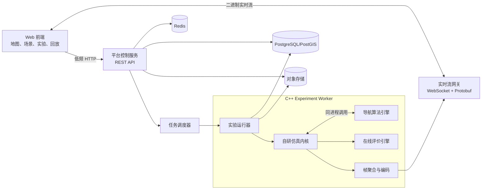

# Zeus 网页端导航算法验证平台：整体方案

> 文档状态：初稿  
> 最后更新：2026-08-27  
> 适用阶段：架构设计与 MVP 规划  
> 维护约定：后续架构、范围或技术决策发生变化时，直接更新本文，并同步修改“决策记录”和“变更记录”。

## 1. 已确定的核心决策

1. 平台完全独立开发，不基于 Apollo、SUMO 或其源代码进行二次开发。
2. Apollo 仅作为模块化、可观测、场景回放和调试体验方面的思想参考。
3. SUMO 仅作为交通仿真设计思想的参考，运行时、构建时均不依赖 SUMO。
4. 导航、交通仿真、在线评价等高频核心运算使用 C++ 实现。
5. HTTP 只用于低频控制面，不用于逐车、逐仿真步传输。
6. C++ 仿真内核与导航算法优先在同一进程内通过函数调用交互；需要隔离时使用共享内存或批量 RPC。
7. 浏览器通过二进制实时流接收经过裁剪、聚合或降采样的数据，不直接消费十万辆车的全部内部状态。
8. 第一阶段以全局导航算法验证为核心，交通仿真优先采用中观模型，并为局部微观和混合仿真预留接口。
9. 中观 MVP 使用确定性的路段密度速度模型：7 m 等效拥堵间距、15% 最低速度比例、入口容量准入和 tick 末迁移提交；当前无随机行为。

## 2. 项目定位

Zeus 是一个面向导航与路径规划算法研发人员的网页端验证平台。用户可以在浏览器中完成地图导入、交通场景配置、算法选择、实验运行、实时观察、结果回放和多算法对比。

平台的主要价值包括：

- 用统一输入和评价标准对比不同导航算法。
- 在动态交通、封路、限速、事故等条件下验证重规划能力。
- 将算法搜索过程、路线变化和交通演化可视化。
- 记录完整实验环境，使实验结果可复现、可回放、可追踪。
- 支持从单车、少量车辆验证逐步扩展到十万级车辆仿真。
- 为后续行为规划、局部轨迹规划和自动化回归测试预留能力。

## 3. 范围定义

### 3.1 第一阶段范围

- 道路级和车道基础拓扑管理。
- 起点、终点、途经点和车辆类型配置。
- 静态与动态道路代价。
- Dijkstra、A*、双向 Dijkstra、双向 A* 等基准算法。
- 中观交通仿真。
- 动态道路事件和事件触发重规划。
- 单实验和批量实验。
- 实时地图、路线、交通状态和算法指标展示。
- 运行记录、回放和多算法对比。
- 十万级在途车辆的基准测试能力。

### 3.2 后续扩展范围

- 车道级微观跟车和变道。
- 城市中观、重点区域微观的混合仿真。
- 行为规划和局部轨迹规划。
- 行人、公交、非机动车和多模式导航。
- OpenSCENARIO 等场景格式。
- 分布式大规模实验集群。
- 用户自定义算法容器和算法排行榜。

### 3.3 非目标

- 第一阶段不建设完整自动驾驶系统。
- 第一阶段不模拟传感器、感知、定位和车辆控制器。
- 第一阶段不追求高保真车辆动力学。
- 不复制 Apollo Dreamview 或其他已有平台的代码和界面。
- 不将浏览器作为正式实验的主要算法计算环境。

## 4. 导航能力分层

平台在架构上区分以下三层，避免把“导航算法”与“自动驾驶规划”混为一体。

| 层次 | 输入 | 输出 | 典型算法 | 实施阶段 |
| --- | --- | --- | --- | --- |
| 全局路径规划 Routing | 路网、起终点、交通权重、车辆约束 | 道路或车道序列 | Dijkstra、A*、双向搜索、ALT、CH | 第一阶段 |
| 行为规划 Behavior | 路线、交通参与者、规则、障碍物 | 跟车、换道、停车、避让决策 | FSM、规则系统、采样决策 | 后续 |
| 局部轨迹规划 Motion Planning | 车辆状态、局部参考线、障碍物 | 带时间信息的连续轨迹 | Hybrid A*、Lattice、Frenet、优化法 | 后续 |

第一阶段围绕 Routing 建设完整闭环，但公共协议、运行记录和评价体系应允许后续添加 Behavior 与 Motion Planning。

## 5. 总体架构

系统分为控制平面、计算平面和数据平面。



### 5.1 控制平面

负责用户操作和实验生命周期管理：

- 项目、地图、场景、算法和实验管理。
- 任务创建、排队、取消、重试和状态查询。
- 权限、审计和配置管理。
- 结果索引和报告查询。

控制平面不处理逐车高频状态。

### 5.2 计算平面

由一个或多个 C++ Experiment Worker 构成：

- 加载指定版本的地图、场景和算法。
- 运行自研交通仿真内核。
- 调用导航算法并处理动态重规划。
- 在线计算指标。
- 生成实时可视化流和完整回放产物。

一个 Run 对应一个独立 Worker 进程或容器。算法异常、内存越界或超时不应影响平台控制服务及其他 Run。

当前 MVP 已先落地两种生命周期：交互式路径规划按不可变地图版本缓存一个只读 `route-worker`，复用地图、R-tree 和 RoutePlanner；交通仿真仍按请求启动隔离的 C++ 进程，并在该进程内部直接调用路由内核。前者优化短查询延迟，后者保留实验隔离，两者都不让逐 tick 数据经过 HTTP。

### 5.3 数据平面

- PostgreSQL/PostGIS：项目、版本、任务、汇总指标及空间元数据。
- Redis：任务租约、短期状态、实时会话和分布式锁。
- 对象存储：地图源文件、算法包、帧记录、日志、Parquet 指标和报告。
- WebSocket 二进制流：面向浏览器的实时数据。

## 6. 推荐技术栈

### 6.1 Web 前端

| 领域 | 技术 | 说明 |
| --- | --- | --- |
| 基础框架 | React + TypeScript + Vite | 主要 Web 应用 |
| 服务端状态 | TanStack Query | API 查询、缓存和刷新 |
| 客户端状态 | Zustand | 场景编辑和播放状态 |
| 地理地图 | MapLibre GL JS | 地理底图和地图交互 |
| 动态图层 | deck.gl | 车辆、轨迹、热力图和大规模图层 |
| 图表 | ECharts | 指标、时序、对比图 |
| 实时通信 | WebSocket | 持久实时连接 |
| 二进制协议 | Protobuf | 仿真帧和事件编码 |
| 本地缓存 | IndexedDB | 回放分块和地图缓存 |
| 测试 | Vitest + Playwright | 单元和端到端测试 |

### 6.2 平台服务

推荐使用 Go 实现控制服务和实时网关：

- REST API：Go 标准库配合 Chi 或 Gin。
- 内部任务接口：gRPC + Protobuf。
- 数据库：PostgreSQL + PostGIS。
- 缓存与短期状态：Redis。
- 对象存储：MinIO 或兼容 S3 的服务。
- 任务调度：MVP 使用 PostgreSQL 任务租约，规模化后引入 NATS JetStream。
- 可观测性：OpenTelemetry、Prometheus、Grafana、结构化日志。

若团队希望后端统一使用 C++，可以将 Go 控制服务替换为 Drogon，但不影响计算平面设计。默认仍推荐 Go 承担平台业务、C++ 承担核心运算。

### 6.3 C++ 计算栈

- C++20。
- CMake。
- Conan 或 vcpkg，项目初始化时二选一。
- Protobuf + gRPC。
- Eigen：矩阵和后续轨迹运算。
- Boost.Geometry：几何计算。
- PROJ：坐标系转换。
- spdlog：结构化日志。
- yaml-cpp：算法和仿真参数。
- GoogleTest：单元测试。
- Google Benchmark：算法和内核基准测试。
- OpenTelemetry C++：链路和耗时观测。

## 7. 核心业务模块

### 7.1 项目与版本管理

一个项目包含地图、场景、算法、实验和评价模板：

```text
Project
├── MapVersion
├── ScenarioVersion
├── AlgorithmVersion
├── EvaluationProfile
└── Experiment
    └── Run
        ├── Metrics
        ├── Events
        ├── Frames
        └── Artifacts
```

地图、场景、算法和评价模板均采用不可变版本。修改时创建新版本，已完成实验始终引用原版本。

### 7.2 地图管理

地图引擎的详细数据结构、导入流程、拓扑规则、CLI 和当前实现状态见 [map-engine-design.md](map-engine-design.md)。

首批支持：

- OpenStreetMap。
- OpenDRIVE。
- GeoJSON。
- 平台自定义 Protobuf/JSON。

平台维护独立的统一地图模型，不以任一外部格式作为运行时内部模型：

```text
Map
├── RoadNode
├── RoadEdge
├── Lane
├── LaneConnection
├── Junction
├── TrafficLight
├── StopLine
├── TurnRestriction
└── CoordinateReference
```

地图导入流水线：

1. 上传并识别源格式、坐标系。
2. 转换为统一内部模型。
3. 检查断路、重复元素、错误方向和非法连接。
4. 建立道路级路由图和车道级仿真图。
5. 构建空间索引和起终点吸附索引。
6. 生成前端所需简化几何或矢量瓦片。
7. 计算内容哈希并发布不可变地图版本。

### 7.3 场景管理与编辑

场景定义由以下部分组成：

- 地图版本。
- 仿真开始时间、持续时间、步长和随机种子。
- 单车任务、OD 矩阵、固定 Trip 和时间段 Flow。
- 车辆类型和出发时间分布。
- 信号灯方案。
- 道路封闭、车道封闭、事故和临时限速。
- 导航算法触发和重规划条件。
- 评价模板。

Web 场景编辑器支持地图点选、区域选择、时间轴事件、属性编辑、合法性检查、克隆和版本对比。

### 7.4 算法管理

算法版本记录：

- 算法 ID、名称、版本和接口版本。
- Git commit、构建时间和编译器信息。
- 配置 JSON Schema 和默认配置。
- 算法包或容器镜像哈希。
- 资源限制、超时和确定性声明。
- 是否支持动态权重、重规划、候选路线和搜索过程输出。

### 7.5 实验编排

一个 Experiment 由以下不可变输入定义：

```text
地图版本
+ 场景版本
+ 算法版本
+ 算法参数
+ 评价模板
+ 随机种子集合
= Experiment
```

参数组合会展开成多个 Run。例如：

```text
3 个算法 × 5 组参数 × 10 个随机种子 = 150 个 Run
```

Run 状态机：

```text
CREATED
→ QUEUED
→ PREPARING
→ RUNNING
→ POST_PROCESSING
→ SUCCEEDED / FAILED / CANCELLED / TIMEOUT
```

### 7.6 实时可视化

当前地图导入、质检、路网展示和位置查询工作台已实现，详见 [web-map-workbench.md](web-map-workbench.md)。

地图主视图展示：

- 道路、车道、路口和信号灯。
- 自车、关注车辆和背景交通。
- 当前路线、候选路线和历史轨迹。
- 搜索扩展节点和搜索边界的采样结果。
- 路段速度、流量、密度、排队和动态代价。
- 封路、事故、限速和重规划位置。

调试面板展示：

- 自车及所选车辆状态。
- 算法耗时和路线代价分解。
- 扩展节点数、Open Set 峰值和缓存命中率。
- 当前道路权重版本。
- 仿真性能、事件、日志和指标曲线。

播放能力包括实时、暂停、单步、倍速、跟车、跳转和历史回放。

### 7.7 结果、回放与对比

PostgreSQL 只保存元数据和汇总指标，高频帧写入对象存储：

- Protobuf + Zstd：可视化回放帧。
- Parquet：逐路段、逐时间段指标和离线分析数据。
- JSON Lines 或 Protobuf：结构化事件。
- 文本或结构化文件：Worker 和算法日志。

回放使用“周期性完整关键帧 + 中间增量帧”。对比功能支持路线叠加、同步双窗口、指标曲线、参数敏感性和多随机种子统计。

## 8. 自研 C++ 仿真内核

### 8.1 内核模块

```text
SimulationKernel
├── SimulationClock
├── EventScheduler
├── MapRuntime
├── TrafficDemand
├── VehicleStore
├── RoadAndLaneRuntime
├── TrafficFlowModel
├── JunctionController
├── TrafficLightController
├── IncidentManager
├── RoutingCoordinator
├── MetricsCollector
├── SnapshotManager
└── FramePublisher
```

### 8.2 仿真时钟

所有模块只读取统一的仿真时间，不直接使用系统墙钟。当前 MVP 支持固定步长和最快速度离线运行；实时模式、暂停和单步属于任务化阶段。MVP 没有随机行为，因此不设置 seed；增加随机需求或驾驶行为后再引入显式确定性随机数流。

仿真配置示意：

```cpp
struct SimulationConfig {
    double step_seconds = 1.0;
    double duration_seconds = 900.0;
    double sample_interval_seconds = 15.0;
    double jam_spacing_m = 7.0;
    double min_speed_ratio = 0.15;
};
```

### 8.3 中观交通模型

第一阶段推荐使用车辆个体存在、路段内部行为简化的中观模型：

- 每辆车保留独立 ID、路线、当前位置、出发和到达时间。
- 路段维护容量、自由流速度、密度、队列和动态旅行时间。
- 路口和信号灯限制单位时间可通过车辆数量。
- 车辆按路段旅行时间和下游容量推进，不进行高频精细跟车。
- 拥堵能够形成、传播和消散，并反馈到导航代价。

该模型优先服务于十万级全局导航和动态重规划验证。

当前已实现的 MVP 使用 `capacity=max(1,floor(length/7m)×lane_count)`，车辆速度为自由流速度乘以 `clamp(1-(occupancy-1)/capacity, 0.15, 1)`。同 tick 车辆读取相同的占用快照，跨边只写迁移缓冲并在 tick 末提交；下游无容量时车辆停在边端点，形成排队和回溢。路口出口容量、信号灯和拥堵反馈重规划尚未实现。实现、接口、测试和武汉实测数字见 [simulation-core-design.md](simulation-core-design.md)。

### 8.4 微观和混合仿真扩展

后续微观模型增加：

- 纵向跟车。
- 速度、加速度和安全距离。
- 车道选择与换道。
- 路口冲突区和通行优先级。

最终可形成混合模式：城市范围采用中观模型，重点区域、自车附近或指定路口采用微观模型。两类模型通过明确的车辆状态转换协议衔接。

### 8.5 车辆状态存储

十万级热路径采用 Structure of Arrays，而不是为每辆车创建包含大量虚函数和动态内存的复杂对象：

```cpp
struct VehicleStore {
    std::vector<VehicleId> ids;
    std::vector<RoadId> road_ids;
    std::vector<LaneId> lane_ids;
    std::vector<float> positions;
    std::vector<float> speeds;
    std::vector<std::uint32_t> route_indices;
    std::vector<std::uint8_t> states;
};
```

核心原则：

- 连续内存和批量更新。
- 仿真 Tick 热路径避免堆分配。
- 不为每辆车创建线程。
- 状态读写采用双缓冲。
- 可并行阶段按路网分区处理。

### 8.6 仿真 Tick

建议固定阶段执行：

```text
1. 应用到期场景事件和信号灯状态
2. 处理车辆生成、进入和退出
3. 更新路段容量、密度和交通统计
4. 收集需要重规划的车辆
5. 批量执行路由请求
6. 计算车辆或车流推进结果
7. 处理路口通行与分区边界迁移
8. 提交下一时刻状态
9. 计算在线指标
10. 生成回放帧和前端可视化帧
```

阶段之间设置同步点，使多线程结果可复现，不允许车辆因遍历顺序不同而产生不确定行为。

### 8.7 并行化

优先按路网区域或连通子图分区，每个分区维护本地道路、车辆和统计，并使用边界迁移队列交换跨区车辆。

```text
并行计算各分区
→ 写入边界迁移缓冲区
→ 同步屏障
→ 提交跨区车辆
→ 进入下一 Tick
```

线程数按 CPU 核数和分区数量决定，不按车辆数量决定。第一阶段先保证单线程正确性和确定性，再增加多线程分区实现。

## 9. C++ 导航算法内核

### 9.1 统一接口

```cpp
class IRouteAlgorithm {
public:
    virtual AlgorithmInfo info() const = 0;

    virtual void initialize(
        const MapGraph& graph,
        const AlgorithmConfig& config) = 0;

    virtual RouteResult compute(
        const RouteRequest& request,
        const DynamicTrafficState& traffic,
        CancellationToken cancellation) = 0;

    virtual ~IRouteAlgorithm() = default;
};
```

RouteRequest 包含起终点、车辆类型、途经点、禁行约束、出发时间、代价偏好、随机种子和最大计算时限。

RouteResult 包含道路或车道序列、几何、总距离、预计时间、总代价、候选路线、耗时、扩展节点数、搜索过程采样和标准化失败原因。

### 9.2 首批算法

- Dijkstra，作为正确性基准。
- A*。
- 双向 Dijkstra。
- 双向 A*。
- K Shortest Paths。
- 动态权重 A*。
- 时间依赖最短路径。

后续增加 ALT、Contraction Hierarchies、D* Lite、LPA* 和多目标路线。

### 9.3 代价模型

代价不能硬编码为最短距离：

```text
cost =
    w_time       × travel_time
  + w_distance   × distance
  + w_congestion × congestion
  + w_turn       × turn_penalty
  + w_change     × lane_change_penalty
  + w_toll       × toll
  + w_risk       × risk
  + user_defined_cost
```

动态交通权重采用版本号管理。权重版本不变时允许复用路径缓存；发生封路、事故或显著拥堵变化时使相关缓存失效。

### 9.4 重规划调度

禁止每个 Tick 为所有车辆重新规划。重规划由以下条件触发：

- 车辆首次进入网络。
- 当前路线失效。
- 前方道路封闭或事故。
- 路线预计代价上升超过阈值。
- 车辆重规划周期到期。
- 用户或场景事件触发。

下一次重规划时间使用时间轮或优先队列管理。相同目的地、相似约束或相同 OD 的请求应支持结果缓存和批量计算。

### 9.5 算法扩展方式

提供两种模式：

1. 内置算法：编译进 Worker，同进程调用，适合受信任且性能敏感的算法。
2. 隔离算法：独立进程或容器，通过批量 gRPC 或共享内存调用，适合第三方算法。

不将不稳定的 C++ ABI 作为通用插件边界。若使用动态库，外层应提供稳定 C ABI；跨版本扩展默认使用进程级 Protobuf 协议。

## 10. 十万级车辆性能设计

### 10.1 性能目标定义

“支持十万级车辆”必须通过明确工作负载定义，建议首个基准为：

- 100,000 辆同时处于在途状态。
- 中观交通模型。
- 城市级道路图。
- 固定 100 ms 或 500 ms 仿真 Tick，实际值通过基准确定。
- 不是所有车辆每个 Tick 都触发路径搜索。
- 单机多核离线运行不低于目标实时倍率，具体倍率在技术验证阶段确定。
- 浏览器全局视图展示路段聚合，局部视图展示裁剪后的单车。

本文档中的十万级首先指内核可维护和推进十万车辆状态，不代表浏览器同时精细绘制十万辆车。

### 10.2 HTTP 使用边界

HTTP REST 仅用于：

- 创建、启动、暂停、取消实验。
- 查询任务、指标和报告。
- 上传地图、场景和算法包。
- 下载回放和结果文件。

以下路径禁止使用逐车 HTTP/JSON：

- 车辆状态更新。
- 每 Tick 仿真状态同步。
- 仿真内核调用导航算法。
- Worker 内部模块通信。

即使使用 gRPC，也必须批量传输车辆或路段状态，不能为每辆车创建一次 RPC。

### 10.3 前端传输量控制

如果每辆车的最小显示状态按约 24 字节计算，十万辆车每帧约为 2.4 MB；每秒 10 帧时原始数据约为 24 MB/s，尚未包含协议、复制和渲染开销。因此前端采用以下策略：

- WebSocket + Protobuf 二进制帧。
- 初始全量帧加后续增量帧。
- 坐标、角度和速度量化。
- 当前视口订阅和服务端裁剪。
- 按缩放等级进行聚合和 LOD。
- 自车和关注车辆始终保留详细状态。
- 全局视图只传输路段流量、速度、密度和队列。
- 前端推送频率独立于仿真 Tick。
- 对慢客户端实施背压和丢弃过期中间帧。

LOD 建议：

| 视图层级 | 展示内容 |
| --- | --- |
| 全城市 | 路段颜色、密度、流量和拥堵，不绘制全部单车 |
| 区域 | 聚合点、聚类或抽样车辆 |
| 道路 | 当前视口内的有限车辆 |
| 车道 | 当前视口内详细车辆和路线 |
| 跟车 | 目标车辆及周边车辆完整调试信息 |

### 10.4 回放与实时流分离

实时流允许降采样和丢弃过期帧，完整实验记录在 Worker 本地分块生成后写入对象存储。实时观看质量不能影响仿真正确性和最终结果完整性。

## 11. 评价体系

### 11.1 导航算法指标

- 路径成功率和不可达率。
- 路径长度、预计时间、实际时间和总成本。
- 相对基准最优差距。
- 搜索耗时及 P50、P95、P99。
- 扩展节点数、Open Set 峰值和峰值内存。
- 重规划次数、重规划耗时和路线稳定性。
- 超时率、取消响应时间和异常率。

### 11.2 交通指标

- 平均速度和平均延误。
- 道路密度、排队长度和吞吐量。
- 网络总旅行时间。
- 车辆到达率和平均到达时间。
- 拥堵形成、持续和恢复时间。
- 路段容量利用率。

### 11.3 公平对比条件

对比实验必须使用相同的地图、场景、随机种子、仿真内核版本、步长、背景交通和资源限制。单次运行结果与多随机种子的统计结果分开展示。

## 12. 可复现性

每个 Run 至少记录：

- 地图和场景内容哈希。
- 算法包、配置和 Git commit。
- Worker、仿真内核和协议版本。
- 容器镜像摘要。
- 编译器、构建类型和关键依赖版本。
- 随机种子、仿真步长和持续时间。
- CPU、内存限制和运行节点信息。
- 开始时间、结束时间和终止原因。
- 指标、事件、帧及日志文件哈希。

固定输入、版本和随机种子应产生确定性结果。多线程版本必须具有专门的确定性回归测试。

## 13. API 与通信协议

### 13.1 浏览器 REST API

```text
POST   /api/projects
POST   /api/maps/import
GET    /api/maps/{id}
POST   /api/scenarios
POST   /api/algorithms/register
POST   /api/experiments
POST   /api/experiments/{id}/runs
POST   /api/runs/{id}/pause
POST   /api/runs/{id}/resume
POST   /api/runs/{id}/step
POST   /api/runs/{id}/cancel
GET    /api/runs/{id}
GET    /api/runs/{id}/metrics
GET    /api/runs/{id}/artifacts
```

### 13.2 实时流

```text
WS /api/runs/{id}/stream
```

主要消息：

```text
RunStarted
FullFrame
DeltaFrame
RoadMetrics
AlgorithmMetrics
SimulationEvent
RunPaused
RunFinished
RunFailed
```

客户端订阅消息包含视口、缩放等级、最大车辆数、关注车辆和期望帧率。

### 13.3 Worker 内部接口

```text
PrepareRun
StartRun
PauseRun
StepRun
CancelRun
GetRunStatus
StreamEvents
CollectArtifacts
```

MVP 可以由控制服务启动 Worker 进程并通过 gRPC 管理。仿真内核、内置算法、评价和帧编码保持同进程调用。

## 14. 建议仓库结构

```text
zeus/
├── apps/
│   ├── web/
│   └── control-server/
├── cpp/
│   ├── map-core/
│   ├── routing-core/
│   ├── simulation-kernel/
│   ├── traffic-model/
│   ├── algorithm-sdk/
│   ├── algorithms/
│   │   ├── dijkstra/
│   │   ├── astar/
│   │   └── bidirectional-astar/
│   ├── evaluation-core/
│   ├── frame-encoder/
│   └── experiment-worker/
├── proto/
│   ├── common/
│   ├── map/
│   ├── scenario/
│   ├── routing/
│   ├── simulation/
│   └── experiment/
├── deploy/
│   ├── docker/
│   ├── compose/
│   └── kubernetes/
├── tools/
│   ├── map-import/
│   ├── scenario-convert/
│   └── result-inspect/
├── testdata/
│   ├── maps/
│   ├── scenarios/
│   └── golden/
└── docs/
    └── overall-architecture.md
```

## 15. 部署方案

### 15.1 开发与 MVP

Docker Compose 部署：

- Web。
- Control Server。
- PostgreSQL/PostGIS。
- Redis。
- MinIO。
- 一个或多个 C++ Worker。

### 15.2 规模化部署

Kubernetes 部署：

- Web 和控制服务水平扩展。
- 每个 Run 使用独立 Job 或 Pod。
- Worker 设置 CPU、内存、PID 和运行时限额。
- 独立计算节点池运行大规模实验。
- 对象存储持久化运行产物。

用户自定义算法默认使用非 root、只读文件系统、无宿主机访问、受限网络和严格资源配额的隔离容器。

## 16. 可观测性

平台需要同时观察业务状态和仿真性能：

- API 请求量、时延和错误率。
- 排队任务数、启动时延和失败率。
- Worker CPU、内存、Tick 耗时和实时倍率。
- 活跃车辆数、完成车辆数和阻塞车辆数。
- 路由请求量、缓存命中、P95/P99 耗时和超时数。
- 实时流客户端数、输出带宽、积压和丢帧数。
- 对象存储写入耗时和产物大小。

日志统一携带 project_id、experiment_id、run_id、worker_id、tick 和 algorithm_version。

## 17. 测试策略

### 17.1 C++ 单元测试

- 图结构、转向限制和代价计算。
- 算法最优性、不可达、超时和取消。
- 车辆生成、路段推进、容量限制和到达。
- 信号灯、封路和动态事件。
- 坐标转换和地图 ID 映射。
- 快照恢复和固定种子确定性。

### 17.2 Golden Case

维护固定小地图及预期结果：直线、环形、等价路线、单行、禁转、封路、拥堵、时间依赖权重和多目标代价。

### 17.3 集成测试

覆盖地图导入、场景发布、任务运行、重规划、指标生成、实时流、产物保存和回放。

### 17.4 性能测试

- 1 万、10 万、100 万道路节点的搜索基准。
- 1 万、5 万、10 万在途车辆的内核基准。
- 不同重规划比例和算法组合。
- 单 Worker 长时间运行和内存稳定性。
- 实时帧编码、带宽和浏览器渲染能力。

## 18. 实施阶段

### 阶段 0：技术验证

- 建立基础 C++ 工程和 Protobuf 协议。
- 实现小型路网、Dijkstra 和 A*。
- 实现最小中观路段推进模型。
- 从 C++ 生成实时帧并在 Web 显示。
- 完成 1 万和 10 万车辆基准，确定数据结构和 Tick 方案。

### 阶段 1：可用 MVP

- 地图导入和统一内部模型。
- 场景编辑和版本管理。
- 四种基准路由算法。
- 中观交通、信号灯和动态道路事件。
- 实验运行、暂停、单步和取消。
- 实时地图、基础指标和结果回放。
- 两个算法的并排对比。
- Docker Compose 一键部署。

### 阶段 2：正式算法验证平台

- 算法 SDK 和隔离插件。
- 批量实验、参数扫描和多随机种子。
- 搜索过程可视化。
- 完整统计对比和报告导出。
- Worker 调度、资源限制和自动重试。
- 十万级车辆性能优化和稳定性验证。

### 阶段 3：微观与混合仿真

- 车道级跟车、换道和路口冲突。
- 城市中观与重点区域微观转换。
- 行为规划和轨迹规划接口。
- 安全性、舒适性和交通规则指标。

## 19. MVP 验收标准

1. 用户可从网页完成地图导入、场景创建、算法选择、实验运行和结果查看。
2. 至少提供 Dijkstra、A*、双向 Dijkstra、双向 A* 四种 C++ 算法。
3. 支持动态封路或拥堵触发重规划。
4. 可以展示路径、交通热力、算法耗时和扩展节点等信息。
5. 结果可保存、回放并对比。
6. 相同版本和随机种子可以稳定复现实验。
7. 中观模式下完成十万在途车辆的受控基准测试，具体实时倍率以阶段 0 的硬件基线确定。
8. 高频仿真链路不依赖 HTTP，不向浏览器无差别推送所有车辆原始状态。

## 20. 风险与应对

| 风险 | 影响 | 应对 |
| --- | --- | --- |
| 自研仿真范围持续扩大 | 延期且难以验证正确性 | 第一阶段坚持中观模型和导航验证目标 |
| 十万车辆同时高频重规划 | CPU 被路径搜索耗尽 | 事件触发、批处理、缓存和分层算法 |
| 浏览器数据量过大 | 卡顿、带宽过高 | 视口裁剪、LOD、聚合、增量和背压 |
| 多线程结果不确定 | 实验无法复现 | 固定阶段、双缓冲、确定性提交顺序 |
| 地图格式差异大 | 导入错误影响算法 | 独立内部模型、验证报告和 Golden Map |
| 插件拖垮 Worker | 实验和平台不稳定 | 进程或容器隔离、超时和资源限制 |
| 微观模型可信度不足 | 指标结论不可靠 | 建立标准场景、守恒检查和模型校准体系 |

## 21. 待进一步决策

以下事项不阻塞整体架构，但应在对应阶段开始前确定：

1. 第一批地图输入以 OSM 还是 OpenDRIVE 为主。
2. 路由主图采用道路级还是从第一版开始同时维护车道级图。
3. 中观模型采用路段队列、Cell Transmission Model，还是两者结合。
4. 十万车辆基准机器的 CPU、内存和目标实时倍率。
5. Go 控制服务具体采用 Chi 还是 Gin。
6. C++ 依赖管理使用 Conan 还是 vcpkg。
7. MVP 是否需要用户登录和多租户权限。
8. 第一阶段是否允许用户上传并运行自定义算法。

## 22. 决策记录

| 日期 | 决策 | 状态 |
| --- | --- | --- |
| 2026-08-24 | 平台不使用 SUMO，自研 C++ 仿真内核 | 已确定 |
| 2026-08-24 | Apollo 和 SUMO 只作为思想参考，不进行二次开发 | 已确定 |
| 2026-08-24 | HTTP 只用于控制面，高频计算保持在 C++ 内部 | 已确定 |
| 2026-08-24 | 第一阶段优先建设中观交通仿真和全局导航验证 | 当前建议，待实施确认 |
| 2026-08-24 | 前端实时流使用 WebSocket + Protobuf，并实施 LOD | 当前建议，待实施确认 |
| 2026-08-24 | 地图引擎采用 SHP 导入、独立标准模型、拓扑编译和只读运行时模型 | 已确定 |
| 2026-08-24 | 仿真车辆使用 edge + offset_s 表示位置，外部坐标才执行地图匹配 | 已确定 |
| 2026-08-24 | Web 地图工作台采用 React + MapLibre，Go 控制服务编排 C++ 地图引擎 | 已实现 |
| 2026-08-25 | 地图编译采用异步任务 + SSE 进度；十万级车辆实时状态仍使用 WebSocket + Protobuf | 已实现 / 边界已确定 |
| 2026-08-25 | 质检问题保留运行时坐标并单独导出 WGS84 点图层；全局问题不伪造位置 | 已实现 |
| 2026-08-25 | 地图源同时支持 Shapefile 数据包和单文件 GeoJSON，二者进入同一拓扑编译管线 | 已实现 |
| 2026-08-26 | 点面 GeoJSON 在检查阶段归类为参考数据，不进入道路拓扑编译；导航输入限定为 LineString / MultiLineString | 已实现 |
| 2026-08-26 | Web 工作台展示拓扑节点、单双向语义和编译后道路属性 | 已实现 |
| 2026-08-26 | 行政区、建筑物和 POI 等点面数据作为工作区参考图层独立存储，不进入导航拓扑和仿真内核 | 已实现 |
| 2026-08-26 | 参考图层支持独立样式管理、源属性检查和显式确认删除，GeoJSON 几何保持不可变 | 已实现 |
| 2026-08-26 | Web 工作台采用白色技术地图界面，参考图层具有独立视口定位能力，详情与质检按任务切换 | 已实现 |
| 2026-08-26 | 图层几何分类优先使用逐要素几何类型统计，混合 LineString / MultiLineString 道路 GeoJSON 可正常导入编译 | 已实现 |
| 2026-08-26 | 路由 MVP：代价=旅行时间，Dijkstra 与 A* 共用统一最优先搜索，A* 启发式为欧氏距离/全图最大限速；吸附端点含正反 twin 虚拟备选；不可达与吸附失败按一等计算结果返回 HTTP 200 | 已实现 |
| 2026-08-26 | 双向搜索：RoutePlanner 持入边 CSR，A* 采用 Ikeda 对称势（起终标签 ±p 相遇即消，mu 即真实代价）；top_f+top_b≥mu 终止，三处连接检测；四种算法在武汉图上代价逐位一致 | 已实现 |
| 2026-08-27 | OSM 汽车路网在拓扑编译前经过独立清洗：道路等级和权限过滤、限速/单双向/桥隧层级标准化，并输出可审计 JSON 报告 | 已实现 |
| 2026-08-27 | Web 导入自动识别 OSM `highway` 字段，清洗在服务端异步任务内完成，中间 GeoJSON 不往返浏览器，清洗摘要随地图版本持久化 | 已实现 |
| 2026-08-27 | 中观仿真 MVP 使用两阶段确定性更新、7 m 路段容量、0.15 最低速度比例、入口容量准入和同 OD 路线池；无随机行为 | 已实现 |
| 2026-08-27 | 同步 HTTP 仅触发受限 C++ 仿真并返回降采样回放；十万级逐 tick 车态仍禁止走 HTTP，后续使用 WebSocket + Protobuf | 边界已确定 |
| 2026-08-28 | `.zmap` v2 增加每方向车道数和 edge-to-edge 转换；路由存在转向规则时使用 incoming-edge 状态保证禁转与惩罚进入最短路松弛 | 已实现 |
| 2026-08-28 | 地图匹配改为边级包围盒范围查询后逐 segment 精确投影，消除长曲线挤出其他道路候选的问题 | 已实现 |
| 2026-08-28 | SUMO 仅作为 connection/meso 设计与离线基准参考；产品运行和地图编译不链接或调用 SUMO | 已确定 |
| 2026-08-28 | OSM PBF via-node restriction 由独立 Go 工具提取为可审计 sidecar，再编译为 `.zmap` v2 edge-to-edge 转换；via-way/conditional 暂不支持 | 已实现 |
| 2026-08-28 | HTTP 路由使用按不可变地图版本常驻的 C++ Worker，长度前缀帧协议复用 MapRuntime/R-tree/RoutePlanner；Go 负责 LRU 驻留上限、取消、重启与关闭回收 | 已实现 |
| 2026-08-28 | 仿真控制统一为确定性时间事件：车辆支持暂停/恢复/速度系数，道路支持开闭/速度/容量系数，路口支持节点开闭；同步阶段运行前批量提交，不经 HTTP 传逐 tick 命令 | 已实现 |

## 23. 变更记录

| 日期 | 版本 | 说明 |
| --- | --- | --- |
| 2026-08-24 | 0.1 | 建立整体方案初稿，明确不依赖 SUMO、自研 C++ 仿真内核及十万级通信方案 |
| 2026-08-24 | 0.2 | 增加地图引擎实现引用，确定运行时车辆位置和 SHP 拓扑编译方案 |
| 2026-08-24 | 0.3 | 增加 Web 地图工作台、Go 地图 API、GeoJSON 展示和点选定位闭环 |
| 2026-08-25 | 0.4 | 增加异步地图编译、SSE 进度与取消、问题图层及地图联动定位 |
| 2026-08-25 | 0.5 | 增加 GeoJSON 道路数据上传、检查、字段映射和拓扑编译支持 |
| 2026-08-26 | 0.6 | 增加几何用途分类和导入门禁，以及节点、方向和道路属性可视化 |
| 2026-08-26 | 0.7 | 增加点面参考图层的 WGS84 转换、持久化 API、样式配置和 Web 显隐叠加 |
| 2026-08-26 | 0.8 | 增加参考要素点选高亮与属性面板，以及图层重命名、样式编辑和删除管理闭环 |
| 2026-08-26 | 0.9 | 重构白色地图工作台，并增加参考图层自动聚焦与手动定位，修复跨城市图层不可见问题 |
| 2026-08-26 | 0.10 | `inspect` 对未知图层类型输出逐要素几何统计，修复混合线几何 GeoJSON 被误判为不支持数据的问题 |
| 2026-08-26 | 0.11 | 新增 `cpp/routing-core`（Dijkstra + A*）、`zeus-map route` CLI、`POST /api/maps/{id}/route` 和 Web 路由模式，武汉真实路网完成基准验证 |
| 2026-08-26 | 0.12 | 路由内核新增双向 Dijkstra 与双向 A*（Ikeda 对称势 + 入边 CSR），四算法交叉验证通过，双向 A* 扩展节点较 Dijkstra 削减 47%–75% |
| 2026-08-27 | 0.13 | 新增 `preprocess-osm` 汽车路网清洗命令、规范化字段和 JSON 报告；武汉真实数据完成清洗、编译和路由回归 |
| 2026-08-27 | 0.14 | Web 与 Go 控制服务接入 OSM 汽车画像：自动识别、参数配置、异步清洗、标准字段编译及清洗报告展示 |
| 2026-08-27 | 0.15 | 新增 C++ 中观仿真内核、`simulate` CLI、Go 同步控制端点和 Web 时间滑块回放；完成武汉 100 车真实路网验证 |
| 2026-08-28 | 0.16 | 新增 `.zmap` v2 转向转换与车道数、edge-state 禁转路由、边级范围地图匹配、车道容量和可读转向 sidecar；双向 A* 势函数改为按需缓存 |
| 2026-08-28 | 0.17 | 新增 OSM PBF 转向 relation 提取器和 Web/Go sidecar 导入闭环，完成武汉 62 个 edge-to-edge 转换实图编译；清理吸附折叠产生的孤儿节点，地图验证恢复为零 error/fatal |
| 2026-08-28 | 0.18 | HTTP 路由切换为按地图常驻 C++ Worker，复用地图与路由索引；实现帧协议、LRU 地图上限、并发串行化、超时重启和优雅关闭；武汉 10 次热请求端到端 P50 20.6 ms、P95 21.8 ms，相对同轮冷请求加速 14.5 倍 |
| 2026-08-28 | 0.19 | 新增车辆、道路、路口三级仿真控制：C++ tick 真实执行暂停、封路、限速、容量和节点门控，CLI/Go/Web 全链路接入控制时间线、目标校验、地图拾取、回放状态与统计 |
